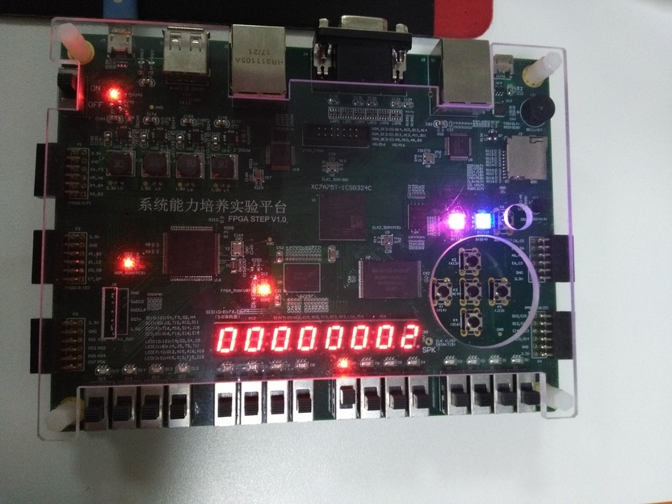
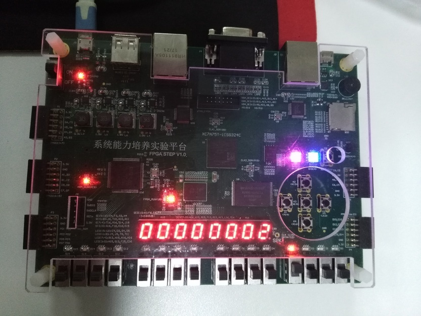

# Musicbox

## 平台

STEP platform

## 功能 
### 复位 
最下面的按钮是复位按钮。最上面的按键是模式切换键，切换到不同的模式时，右侧的RGB—LED会显示不同的颜色提示当前状态，蓝色表示音乐播放模式，红色表示音乐演奏模式，绿色表示写入模式（仍有bug）。
### 音乐播放 
fpga中通过寄存器文件预存了4首音乐，数码管前四位显示音乐的数目（0开始，3表示4首）；后四位显示当前曲目，通过左右按键调换歌曲，中间的按键表示：play/pause按键，在播放状态和暂停状态间切换。播放状态中左侧LED会显示紫色。存储的曲谱与音乐演奏的格式相同，音乐播放的时候对应的开关上方led会亮。
### 音乐演奏 
当右侧LED显示红色时，表示音乐盒在音乐演奏模式，可以通过拨动fpga前端的16个开关来发出相应的音。（一次拨动一个按键，拨动两个开关时会停止发出声音）。左右按钮可以调节声音的频率范围，相应地数码管显示当前的频率范围。频率是以十二平均律划分，以 __4186Hz - 7902Hz__，数码管显示的为当前频率段比基础频率段频率倍数对1/2的幂次。中间的按键仍然是播放/暂停按键，处于播放状态时左侧LED会发出紫色光，处于暂停状态时拨动开关无效。
### 写入模式[[1]](#f1)

当右侧LED亮起绿灯时，进入写入模式，此时通过usb串口写入乐谱数据覆盖原先寄存器文件的数据，然后直接播放写入的乐曲（仍有bug）。
### 节拍器

- 当右侧LED显示黄色时，进入节拍器模式。
- 频率通过按钮调节，中间按钮增减10，左右按钮增减1 
- 最下面按钮为复位按钮
- 节奏通过开关调节，每个周期 分为16份，如果第k个开关开启，蜂鸣器将在第k份响起。如开启SW[0], SW[4], SW[8] 和SW[12]，节拍器的节奏为每周期四个4分音符。 
- 节拍器暂停：所有开关为off状态，此时rgbLED蓝色熄灭。

## 演示 
- 按下复位按钮，音乐盒进入初始状态。此刻右侧红色LED亮表示在音乐播放状态，此时数码管前半部分显示的为歌曲数目，后半部分显示的为当前歌曲序号（初始状态为0）。

- 通过左右键调节当前歌曲，按下中间按钮，此时左侧红色蓝色LED亮表示开始播放。[[2]](#f2)

- 通过上方按钮调节当前模式，当前切换到音乐演奏模式[[3]](#f3)拨动开关会发出相应声音且开关上方LED会亮。上发出的音为# F2，下发出的音为# A2。默认（复位后）的频率段为5。

 

- 通过左右按钮调节当前音符高低[[4]](#f4)当前音符为# A7（由于处于暂停状态，此时不发出声音）。

- 右侧绿灯亮起时，进入写入模式，此时需将另一个usb接口连接电脑，通过python写入数据，数码管左侧显示的为当前写入的地址（寄存器的索引），右侧为当前读入的8bit信息的内容。

- 节拍器模式:右侧黄灯亮起时。如果开关均闭合，此时节拍器暂停，不发出声音。拨动相应的开关，LED循环亮起，亮到被拨动的开关处时节拍器响一下，左右和中间按钮调节节拍器频率，左右分别为-1和+1，中间为+10

##  原理  
###  播放原理  
本音乐盒以音乐播放模块为基础，以 __4186Hz-7902Hz__ 为基础，设数码管显示的数字为a，则实际频段为 __4186 × 2a Hz - 7902 × 2a Hz__，中间12个开关触发当前频段上的C-B音，左侧两个为a-1频段的 .# A, B，右侧两个为a+1频段的C, # C，寄存器内存储的数据每条长12bit，前四位为音名（与开关作用相同），中间三位为频段（与音乐演奏时数码管上显示的值作用相同），最后五位为时长，以16分音符为单位，时长为该值与16分音符时长的乘积。经过当前音的时长时间再读下一条数据。因此由串口输入的数据也必须按照此格式。
###  串口通信原理  
采用的是python的serial库用来写入数据，在没有有效数据传输时，串口始终保持高电平，当准备传输数据时，变为低电平，每位数据保持 1/波特率 时间，8bit数据（1byte）传输之后重新进入高电平状态，等待下一次数据传入。

因此fpga端的串口接收使用有限状态机，使用时钟信号产生每 __1/2 × 波特率__ 时间反转一次的脉冲信号作为控制信号。开始处于IDLE状态等待接收，当接收到0之后进入RECV状态，每次控制信号上升沿读一次数据（使用移位寄存器），读完8位之后进入END状态，END状态则输出读出的数据，然后直接跳转到IDLE状态等待下一byte数据。
###  模块  
- decode(音乐播放模块，从regfile中提取数据解码得到musicbox模块能读取的数据。
- musicbox(主模块，负责发出声音，调节频率段等)
- no\_fitter(去抖动模块，负责几个按钮的去抖动)
- regfile(寄存器文件，负责存储预置音乐及后面的写入)
- seg(数码管解码，负责将由model\_ctl模块输出的32位数据解码成七段数码管可读的数据)
- model\_ctl(模块控制，负责根据模式按钮调整模式并相应地改变连线)
- uart(串口通信模块，负责从串口中读取数据并将数据解码传递给regfile模块写入)
- top(顶层模块，负责模块之间的连线)

Footnotes
=========
1.  由于部分原因，目前此模式仍有bug. [$\hookleftarrow$](#a1)
2.  歌曲播放结束后会重新开始播放. [$\hookleftarrow$](#a2)
3.  播放/暂停状态不会随模式切换改变。[$\hookleftarrow$](#a3)
4.  播放模式共有8个八度（按照钢琴），但由于蜂鸣器性质，频率段调至5之后的音很难听，因此也调整了内置音乐的频率。[$\hookleftarrow$](#a4)

